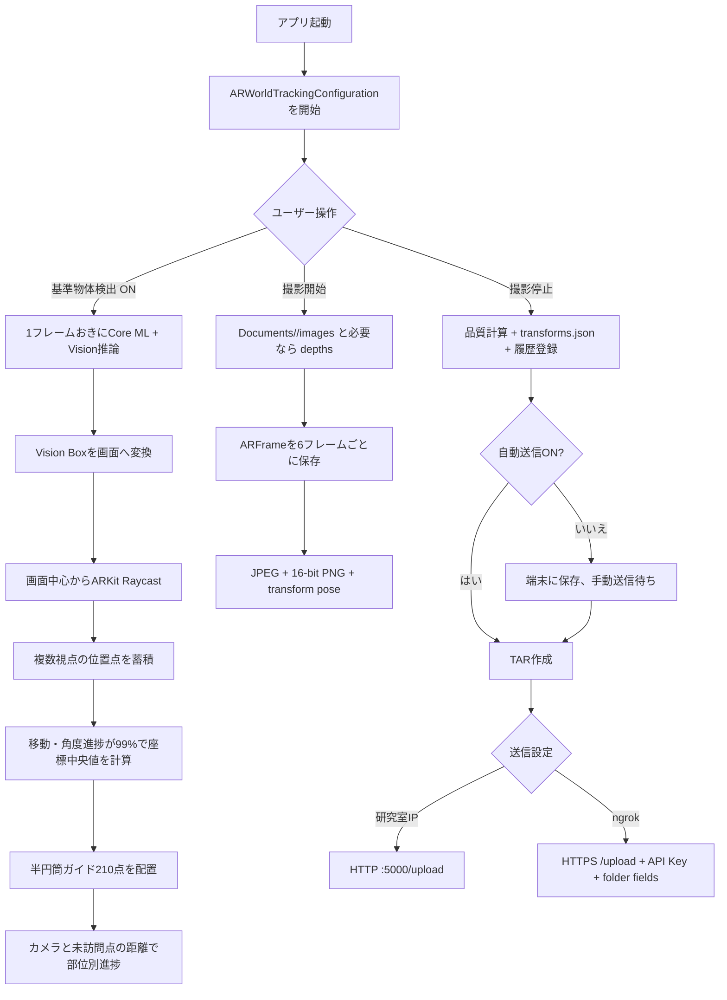

# iPhonePlantApp 完全再実装仕様書

最終確認日: 2026-09-26

対象ソース: Git commit `95e9174` (`main`, v3.5.0)

対象: iOSアプリ、AR撮影、Core ML/Vision推論、撮影データ生成、アップロードクライアント

この文書は、リポジトリの現行コードと同梱Core MLモデルから確認できる仕様をまとめたものです。**現行コードで実際に行っていること**と、**再実装時に必要だがリポジトリにない情報**を分けて記載します。コメント上の説明と実行コードが食い違うところは、実行コードを正とします。

## 0. まず押さえるべき現状

このアプリは、ARKitでiPhoneのカメラ画像、カメラ姿勢、LiDAR深度を一定間隔で収集し、NeRF向けの画像・深度PNG・`transforms.json`を作って端末内へ保存します。撮影完了後、セッション一式を**圧縮しないtarアーカイブ**にして、研究室内IPまたはHTTPS/ngrokへ送ります。

「植物AIスキャン」という表示だけから植物をAI認識していると考えると誤解があります。現行実装のAIモデルは、同梱Core MLモデルにある**単一クラス `kendama` の物体検出モデル**です。アプリは検出結果を「基準球 (`ref_sphere`)」として扱っています。トマトの葉、実、茎を認識するモデルや、植物領域を分割する処理は確認できません。部位別進捗はAIによる植物認識ではなく、基準物体周辺に置いた仮想ガイド点へカメラが接近した割合です。

また、`ObjectDetector.detect` は雛形で常に空配列を返します。`CoordinateTransform` と `PointCloudVisualizer` も定義されていますが、アプリの現行フローから呼ばれていません。実際に呼ばれている推論は `RefSphereDetector` です。

## 1. 実装範囲と再実装の前提

### 1.1 ビルド構成

| 項目 | 現行値 |
|---|---|
| UI / 言語 | SwiftUI、Swift 5 |
| プロジェクト | `iPhonePlantApp.xcodeproj`、単一iOSアプリTarget |
| プロジェクト形式 | `objectVersion = 77`、Xcode 26.3で作成された設定 |
| Deployment Target | iOS 26.2 |
| 対象デバイス | iPhone / iPad。LiDAR撮影には対応ハードウェアが必要 |
| 外部Swift Package / CocoaPods | 現行プロジェクトには登録なし |
| 署名 | Team IDは固定されていない。実機ビルド時に利用者がXcodeで設定 |
| Bundle Identifier | `iPhonePlantApp1.0.iPhonePlantApp`。配布先の署名Teamで利用可能か確認が必要 |

ソースのビルド所属は `PBXFileSystemSynchronizedRootGroup` により `iPhonePlantApp/` 以下を同期する方式です。したがって、SwiftファイルだけでなくAssets CatalogとCore ML `.mlpackage` の全構成ファイルも必要です。`Info.plist` はTarget設定で個別指定され、同期グループから除外されています。

### 1.2 フレームワーク

現行Swiftソースで使われている主なApple Frameworkは SwiftUI、UIKit、ARKit、RealityKit、Vision、CoreML、CoreImage、CoreVideo、Foundation、Combine、Security、UniformTypeIdentifiers、AppleArchive、Systemです。TARはAppleArchiveを使わず、`UploadManager.createTAR` 内で512-byte blockを直接組み立てています。

### 1.3 ソースファイルの責務

| ファイル | 責務 | 現行フローでの状態 |
|---|---|---|
| `iPhonePlantAppApp.swift` | `ContentView`をルートに起動 | 使用中 |
| `ContentView.swift` | AR画面、操作ボタン、品質表示、履歴、送信の起点 | 使用中 |
| `ARScannerView.swift` | ARKitセッション、カメラフレーム、基準物体推論、座標変換、ガイド点 | 使用中 |
| `DataRecorder.swift` | RGB/Depth/姿勢保存、品質指標、JSON生成 | 使用中 |
| `RefSphereDetector.swift` | バンドルモデルをVision経由で呼び、基準物体候補を返す | 使用中 |
| `UploadManager.swift` | 命名、履歴、TAR、IP/ngrok送信、Keychain連携 | 使用中 |
| `ServerSettingsSection.swift` | IP/ngrok設定、APIキー、保存先階層のUI | 使用中 |
| `SideMenuView.swift`, `HistorySection.swift`, `NamingRulesSection.swift` | 設定、履歴、命名ルールUI | 使用中 |
| `BoundingBoxOverlay.swift` | 正規化Rectを赤枠で描画 | 使用中 |
| `ObjectDetector.swift` | 一般物体検出のテンプレート | **未接続。常に空配列を返す** |
| `CoordinateTransform.swift` | 2D点とsceneDepthから3D座標を計算する旧ヘルパー | **現行フローから未呼び出し** |
| `PointCloudVisualizer.swift` | AR特徴点を球で表示する補助 | **現行フローから未呼び出し** |
| `KendamaDetector.swift` | 旧検出器の説明だけ | **obsolete** |
| `TomatoPlantVector` (`ContentView.swift`) | SwiftUIでトマト株アイコンを描くView | **定義はあるが現行画面で未生成** |

## 2. アプリの処理フロー



この図はコード上の呼び出し関係です。OSのARKit内部SLAM、カメラISP、Core MLの個別レイヤ計算をアプリが実装しているという意味ではありません。

## 3. ARセッションとモード

### 3.1 起動時

`ContentView` は `ARWorldTrackingConfiguration.supportsFrameSemantics(.sceneDepth)` または `.smoothedSceneDepth` を調べます。対応なら初期モードは `.full`（画面表記「LiDAR オン」）、非対応なら `.off` です。

`ARScannerView.makeUIView` はRealityKit `ARView`を生成し、環境のscene understandingに`.occlusion`を加えます。デバッグ表示を無効化し、person occlusion、depth of field、motion blur、camera grain、face mesh、grounding shadowsなどを無効にします。これらは表示設定で、保存画像を後処理する設定ではありません。

### 3.2 モードの設定

| モード | `frameSemantics` | `sceneReconstruction` | `expectsDepth` |
|---|---|---|---|
| `.full` / LiDAR オン | 対応していれば `.smoothedSceneDepth` 優先、なければ `.sceneDepth` | `.mesh`対応ならmesh | true |
| `.slamOnly` / SLAMのみ | 空 | 空 | false |
| `.off` / LiDAR オフ | 空 | 空 | false |

3モードとも `ARWorldTrackingConfiguration` を使います。`.slamOnly` と `.off` はARKit設定上ほぼ同じで、表示文字、録画ステータス、`expectsDepth`、world origin resetの扱いなどに差があります。モード変更時は `.resetTracking` と `.removeExistingAnchors` でセッションをリセットします。オートフォーカスは有効です。

録画開始時、`.off` 以外は `setWorldOrigin(relativeTransform: matrix_identity_float4x4)` を要求します。`.off` は現在のセッション原点を使います。`sceneReconstruction = .mesh` はfull modeのときだけ設定されますが、メッシュをファイルへ保存する処理はありません。

カメラ停止はARSessionをpauseし、検出Boxをクリアします。再開時はセッションを再構成するため、トラッキングをリセットします。

## 4. AI / 物体検出の仕様

### 4.1 バンドルモデル

リポジトリの `iPhonePlantApp/yolo_kendama_best.mlpackage/` が実行時推論モデルです。Xcodeがbuild時にコンパイルしてアプリBundle内の`.mlmodelc`にします。モデル指定そのものは `model.mlmodel`、学習済みパラメータは `Data/com.apple.CoreML/weights/weight.bin` にあります。

| 属性 | モデル内メタデータから確認できる値 |
|---|---|
| モデル表示名 | `YOLO_kendama_best` |
| 元フレームワーク | Ultralytics YOLO、metadata上のバージョン `8.4.37` |
| タスク | object detection (`detect`) |
| 入力 | image、エクスポート画像サイズ `[320, 320]` |
| クラス | 1クラス、ID `0` = `kendama` |
| NMS | export args `nms: True`、`end2end: False` |
| export batch | 1 |
| export時のdynamic shape | false |
| export metadata上のIoU threshold | 0.7 |
| export metadata上のconfidence threshold | 0.25 |
| Core ML出力説明 | `coordinates`: 相対 `[x,y,width,height]`、`confidence`: class confidence |
| 学習データ由来の識別子 | `.../yolo_dataset_final/dataset_final.yaml` と記録 |
| metadataの作成日 | 2026-05-18 |
| モデルmetadataのライセンス表記 | AGPL-3.0 |

ここにあるthreshold値はモデルの埋め込みメタデータです。アプリコードがVision requestでoverrideしている値ではありません。学習画像、dataset YAML、学習スクリプト、epoch、optimizer、augmentation、学習時confidence設定などはリポジトリにないため、**同じ重みの推論はモデル一式を使えば再現できますが、学習過程から同じ重みを再学習する情報は不足しています**。モデルを再配布する場合は、metadataにあるライセンス条件を別途確認してください。

### 4.2 モデルロード

`RefSphereDetector.shared` はBundle内の`.mlmodelc`を以下の優先順で探します。

1. `yolo_kendama_best`
2. `yolo26n`
3. `yolo26n_nms`
4. `kendama_detector`
5. Bundle内で最初に見つかった`.mlmodelc`

`MLModelConfiguration.computeUnits = .all` にし、`MLModel(contentsOf:)`を作成して`VNCoreMLModel`に包みます。失敗内容は `modelLoadStatusMessage` に保存します。モデル未ロード時の推論呼び出しでは再ロードを一度試します。

### 4.3 推論と後処理

`ARSessionDelegate.session(_:didUpdate:)` のframe counterを増やし、**2フレームに1回**だけglobal `.userInitiated` queueから検出を依頼します。画像は `frame.capturedImage`、Vision image orientationは`.up`です。`VNCoreMLRequest.imageCropAndScaleOption = .scaleFill` のため、Visionが入力領域をモデル入力へscale-fillします。アプリ側の独自letterbox、RGB正規化、NMSはありません（NMSはモデル側で有効と記録されています）。

検出候補のフィルタ条件は、各Observationのlabels内に次のどれかがあり、そのlabel confidenceが`>= 0.50`であることです。

```text
identifier に "kendama" を含む
OR identifier == "class_0"
OR identifier が "class" で始まる
OR identifier == "0"
OR results.first の labels 数が1
```

最後の条件は全Observationで`results.first?.labels.count`を参照します。モデルが1クラスならlabel名の一致がなくても通り得ます。valid Observationは信頼度順にsortせず、`validObservations.first`を採用します。採用後の返却値はlabel名を固定文字列`ref_sphere`にし、confidenceはそのObservationの`labels.first`のconfidenceを使います。

つまり推論の実質的な閾値は、モデル出力をVisionが作った後のアプリ側`0.50`です。モデルmetadataの`0.25`とIoU`0.7`はexport/default metadataの値として記録し、コードから別の値を渡してはいません。

Vision errorはcompletionへ返します。`handler.perform([request])` のthrowは `try?` で捨てられるため、その種の実行エラーではcompletionが呼ばれない可能性があります。

### 4.4 AI機能の有効範囲

このモデルはkendamaを学習対象にした検出器であり、トマト株の部位検出器ではありません。基準球のUI名と学習クラスの対応を変えて使っています。再実装時に本物の「トマトのAI認識」が必要なら、別の学習済みモデル、クラス定義、学習データ、前処理/後処理、評価指標を用意する必要があります。

## 5. 基準物体の2D→3D配置とスキャン進捗

### 5.1 画面BoxからRaycast

Visionの`boundingBox`は正規化値で原点が左下です。画面表示用に次を作ります。

```text
topLeftRect.x = box.minX
topLeftRect.y = 1 - box.minY - box.height
topLeftRect.width = box.width
topLeftRect.height = box.height
displayBox = topLeftRect.applying(frame.displayTransform(interfaceOrientation, viewportSize))
screenPoint = (displayBox.midX * viewportWidth,
               displayBox.midY * viewportHeight)
```

Boxは`BoundingBoxOverlay`で赤線幅2.5pt、中心8pt赤丸、半径28pt破線リング、線幅1.5pt十字照準として描きます。AR raycast queryは`estimatedPlane` / alignment `.any`を先に作り、queryが作れなければ`existingPlaneGeometry` / `.any`を試します。返った最初のRaycast resultのworldTransform translationをBox中心の3D候補とします。

**アクティブな基準点決定は深度mapの画素値をサンプルしていません。** `CoordinateTransform.convertTo3D` はsceneDepthから3D化する別実装ですが、現行コールサイトはありません。現在の基準点はARKitのRaycast結果です。

### 5.2 複数視点キャリブレーション

guide anchorが未作成で、検出とRaycastが成功したとき、最初のカメラ姿勢を`startCameraTransform`として記録し、各Raycast世界座標`p_i`を`calibrationPoints`へ追加します。カメラの開始位置`p0`と現在位置`p`の移動量、および開始/現在のforward vector間の角度を計算します。

```text
d = ||p - p0||                                         [m]
u0 = -startTransform.column(2).xyz
u1 = -currentTransform.column(2).xyz
theta = acos(clamp(dot(u0, u1), -1, 1))                 [rad]
moveRatio = min(1, d / 0.12)
angleRatio = min(1, theta / 0.21)
rawProgress = 0.5 * moveRatio + 0.5 * angleRatio
progress = max(previousProgress, rawProgress)
```

12cmは移動基準、0.21radは約12度の角度基準です。角度と移動の平均で、各々50%を占めます。過去最大値を保持するので進捗は減りません。`progress >= 0.99`でanchorを確定します。100%相当には通常、移動・回転の両方が必要です（片方だけ最大なら上限50%）。時間やユニーク視点数、球の半径・中心モデルへの幾何フィットは条件にしていません。

anchor位置は各座標成分の独立中央値です。

```text
center = (median(x_i), median(y_i), median(z_i))
```

これは座標ごとのmedianであり、点群に対する幾何学的medianではありません。偶数個は中央2値の算術平均、空配列なら原点を返します。

### 5.3 ガイド半円筒

カメラ方向を中心にした180度の半円を、world Y方向に7段作ります。

```text
voxelCountPerRing C = 30
ringOffsets = [0.05, -0.05, -0.15, -0.25, -0.35, -0.45, -0.55] m
guideRadius R = 0.50 m
centerAngle = atan2(cameraZ - centerZ, cameraX - centerX)
fraction(i) = i / (C - 1),   i = 0..29
angle(i) = centerAngle - pi/2 + fraction(i) * pi
x = R*cos(angle); y = ringOffset; z = R*sin(angle)
```

配置数は7×30=210個です。各ガイド点は一辺0.02mのcube、初期色はalpha 0.65のcyan、roughness 0.2、metallic 0.1です。基準中心には半径0.01mのcyan sphere (roughness 0.05, metallic 0.9)を置きます。anchor自体は位置`center`に置かれ、rotationは特別に指定していません。

### 5.4 訪問判定と5部位進捗

AR frameごとにカメラworld positionと未訪問ガイド点のworld position間距離を計算します。

```text
visited[i] = true, if distance(cameraPosition, voxelPosition) < 0.08 m
```

一度訪問された点は同じガイドanchorが残る間は戻りません。訪問時にcubeを緑(alpha 0.65)へ変更し、medium impact hapticを鳴らします。総点数210を次の領域に分け、`visitedCount / totalCount`を表示値にします。

| 部位 | ring index | 列index | 点数 |
|---|---:|---:|---:|
| Top | 0–1 | 全30列 | 60 |
| Middle Left | 2–4 | 0–14 | 45 |
| Middle Right | 2–4 | 15–29 | 45 |
| Bottom Left | 5–6 | 0–14 | 30 |
| Bottom Right | 5–6 | 15–29 | 30 |

録画状態が変化すると`resetVoxelContactState()`が呼ばれ、訪問状態、色、5進捗値を0に戻します。検出自体をOFFにするとanchor、calibration点、進捗、Boxも削除します。検出UIは通常のタップでは撮影中に切替不可です。

Progress overlayは検出ON、calibration終了、録画中にだけ表示されます。`AppLogo`画像をグレースケール状ベースとして使い、各部位位置にRadialGradientをマスク合成しています。色の段階は0=灰、`0 < p < 0.35`=赤、`<0.65`=橙、`<0.90`=黄、それ以外=緑です。これは別の植物形状推定ではありません。

## 6. 撮影データと保存処理

### 6.1 セッション生成

撮影開始時にDocuments以下へセッションdirectoryを作ります。

```text
Documents/<session-name>/
├── images/
├── depths/                 # lidarMode == .full のときだけ作成
└── transforms.json         # 撮影停止時に作成
```

テンプレートは`UploadManager`に保存され、初期ルールは `nerf_dataset_[Date]_[Time]` です。サポート置換文字列は次の通りです。

| トークン | 置換値 |
|---|---|
| `[YYYY]`, `[MM]`, `[DD]` | Calendar.currentの年/月/日、4/2/2桁 |
| `[HH]`, `[mm]`, `[ss]` | 時/分/秒、2桁 |
| `[Date]` | `yyyy-MM-dd` |
| `[Time]` | `HH-mm-ss` |
| `[Count]` | Documentsに同じ名前が存在しない最小の1始まり整数 |

`DateFormatter`は現在のシステムtimezone/locale設定を使います。`[Count]`なしの場合、生成名が既存directoryと衝突しないか検査しません。テンプレート名のパス文字や長さもアプリ側では検証していません。

### 6.2 フレーム採取レート

録画中、ARSession delegate callback counterを増やし**6 callbackごとに1回** `recordFrame` を呼びます。時間ベースのFPS指定ではなく、カメラ/AR callback frequencyに依存します。`frameThrottleCounter`は録画開始時にリセットされません。tracking stateが`.notAvailable`のframeはdelegate先頭で捨てます。

frame numberは0から始まり、`frame_0000`, `frame_0001`, …です。番号増加はrecord呼び出し時に行います。画像処理は各frameごとにglobal `.userInitiated` queueへ投げます。

### 6.3 RGB画像

`frame.capturedImage`を`CIImage`にし、`CIContext.writeJPEGRepresentation`でsRGB JPEGにします。コードが設定する圧縮品質は0.9です。元画像サイズはCVPixelBufferのwidth/heightからJSONに記録します。回転・crop処理は保存前に明示していません。Vision UIの向き補正と保存JPEGの向き補正は別処理です。

### 6.4 深度画像

`.full`では`sceneDepth ?? smoothedSceneDepth`の順で深度データを選び、`depths/frame_NNNN.png`として16-bit grayscale PNGを保存します。解像度はdepth mapの実サイズをそのまま使い、RGB解像度へresizeしません。

旧引継ぎ書には256×192と記載されていますが、現行コードはその値を固定していません。実機/OSが返したdepth pixel bufferのwidth/heightを採用するため、再実装で256×192を定数として焼き込まないでください。

各Float値`m`は次のように変換します。

```text
if NaN, ±Inf, or m <= 0: u16 = 0
otherwise: u16 = UInt16(truncate(min(m * 1000, 65535)))
```

単位はmmで、0は無効値です。最大値は65535mm（約65.535m）に飽和し、小数部は整数変換時に切り捨てられます。入力pixel formatは`DepthFloat32`と`DepthFloat16`を処理します。`bytesPerRow`を考慮して読み、出力は連続したwidth×height配列です。PNG生成時にUInt16をBig Endianへ変換し、CoreGraphicsに`byteOrder16Big`、gray color space、16 bits/componentで渡します。

Nerfstudio用`transforms.json`には`.full`なら`depth_unit_scale_factor: 0.001`が入ります。これはmmをmへ換算する係数です。confidenceMapの取得、信頼度しきい値処理、深度のRGB画素へのresampling、深度固有intrinsicsの書き出しはありません。

### 6.5 姿勢と`transforms.json`

各frameのJSON elementは以下です。

```json
{
  "file_path": "images/frame_0000.jpg",
  "depth_file_path": "depths/frame_0000.png",
  "transform_matrix": [[r00, r01, r02, r03], [r10, r11, r12, r13],
                       [r20, r21, r22, r23], [r30, r31, r32, r33]],
  "fl_x": 0,
  "fl_y": 0,
  "cx": 0,
  "cy": 0,
  "w": 0,
  "h": 0
}
```

`transform_matrix`はARKit `camera.transform` のSIMD列を行ごとに並べ直してJSON 4×4配列にします。座標系変換・軸反転・scaleは行いません。intrinsicsは`fl_x = K[0][0]`, `fl_y = K[1][1]`, `cx = K[2][0]`, `cy = K[2][1]`としてソースコードどおり取得し、w/hはcapturedImageサイズです。深度ファイルを選べたときだけ`depth_file_path`が加わります。

root object:

```json
{
  "camera_model": "OPENCV",
  "orientation_override": "none",
  "frames": [ /* per-frame objects */ ],
  "fl_x": 0, "fl_y": 0, "cx": 0, "cy": 0, "w": 0, "h": 0,
  "depth_unit_scale_factor": 0.001
}
```

rootのintrinsics等は最初のframeからコピーし、深度係数は深度を期待するモードにだけ出します。フレームtimestamp、distortion coefficients、mask、depth-specific intrinsics、sensor exposureなどは書きません。`framesData`は非同期処理完了時にmain queueへappendされるため、JSON frame配列がファイル名順になる保証はありません。

## 7. 撮影品質スコア

品質スコアは撮影補助の独自heuristicであり、NeRFの最終品質を直接測定した値ではありません。

### 7.1 tracking stability

各記録対象frameについて、tracking stateが`.limited`なら`limitedTrackingFrames`を加算します。

```text
stability = totalFrames > 0 ? 1 - limitedTrackingFrames / totalFrames : 1
```

`.notAvailable` frameは`recordFrame`に入る前に破棄されるため分母に入りません。

### 7.2 motion stability

隣接して保存対象になったcamera pose間で計算します。

```text
dt = timestamp_t - timestamp_(t-1)
v = ||position_t - position_(t-1)|| / dt                    [m/s]
omega = angle(q_(t-1)^-1 * q_t) / dt                        [rad/s]
vExcess = clamp((v - 0.5) / (1.5 - 0.5), 0, 1)
wExcess = clamp((omega - 0.52) / (1.57 - 0.52), 0, 1)
penalty_t = max(vExcess^2, wExcess^2)
avgPenalty = sum(penalty_t) / totalFrames
motion = (1 - avgPenalty)^2
```

`dt <= 0`ならその区間のpenaltyは追加しません。平均の分母は有効interval数ではなくframe数です。最初のframeも`totalFrames`には入りますがpenaltyはありません。

### 7.3 depth coverageと合成

各record対象depth mapについて`Float32 > 0`をvalidとして数えます。

```text
coverage = totalDepthValidPixels / totalPixelsCount
```

深度を期待しない/計数可能pixelがない場合は0です。コードはcoverage計数時にpixel bufferをFloat32 pointerとして読みます（PNG writer自体はFloat16/Float32両方に分岐）。

```text
if expectsDepth:
  score = Int(40*stability + 40*motion + 20*coverage)
else:
  score = Int(50*stability + 50*motion)
```

`Int`変換は小数を切り捨てます。UIのscore colorは70以上green、40以上orange、それ未満redです。品質メッセージは次の優先順位です。

1. stability `< 0.8`: tracking不安定
2. motion `< 0.6`: 動きが速い
3. motion `< 0.85`: 少し速い
4. depth expectedかつcoverage `< 0.5`: 深度不足
5. score `< 60`: 総合品質低め
6. それ以外: 非常に良い

## 8. 端末内状態、履歴、自動送信

| 設定/データ | 保存先 | 初期値・挙動 |
|---|---|---|
| Server IP | UserDefaults key `server_ip` (`@AppStorage`) | 空文字 |
| 宛先モード | `upload_destination` | `localIP` |
| ngrok base URL | `ngrok_base_url` | 空文字。入力時に保存 |
| API key | iOS Keychain | service=Bundle ID、account=`ngrok-upload-api-key`、`AfterFirstUnlockThisDeviceOnly` |
| upload folder levels | `ngrok_upload_folder_levels` | 0–2要素。旧キー`upload_folder`/`upload_subfolder`を初期読込で引継ぎ |
| auto upload | `auto_upload_enabled` | true |
| naming rules | `naming_rules` JSON | `["nerf_dataset_[Date]_[Time]"]`相当の既定ルール |
| active naming rule | `active_naming_rule_id` UUID文字列 | 最初のルール |
| session history | `upload_sessions` JSON | status/相対path等 |
| image/depth/session content | アプリDocuments | upload成功後もローカル保持 |

セッション状態は` savedLocal -> uploading -> uploaded`または`failed`です。アプリ再起動時、前回`uploading`だったrecordは中断として`failed`へ直します。pending数は`savedLocal`と`failed`の件数です。再送後もアップロード成功しても画像フォルダは削除しません。履歴の個別削除/全削除は端末上のsession folderを物理削除します。

Keychainのservice名にBundle Identifierを使うため、Bundle Identifierを変えると以前保存したAPI keyは別service扱いとなり、設定画面で再入力が必要です。`ThisDeviceOnly`なのでKeychain itemは別端末へbackup migrationしません。

撮影停止でQuality Reportを表示し、auto uploadがONならReportを閉じたとき（通常は表示から5秒後にも自動で閉じる）にpending一式を順番に送ります。手動の場合は画面左上の再送ボタンを使います。ボタン長押し0.5秒でauto/manualを切替えます。個別アップロードは一件ずつ直列処理し、失敗しても次のsessionを試します。このコードに指数backoff等の自動ネットワーク再試行はありません。「再送」はユーザー操作で失敗/未送信をもう一度送る意味です。

## 9. TARと送信形式

### 9.1 TARの作り方

各session directory内の`subpathsOfDirectory`を列挙し、directory自身はentryにせず、通常ファイルだけをtarへ追加します。entry名はsession rootからの相対パスです。最上位session名をtar内に追加しません。

TAR writerの定数/処理:

| 項目 | 値 |
|---|---|
| header block | 512 bytes、初期値すべて0 |
| pathname | UTF-8 bytesを最大99 bytesまでheader先頭へコピー |
| size | offset 124、`%011o\0` octal |
| typeflag | offset 156にASCII `0` (regular file) |
| checksum | 148–155をspaceにして512 bytesを加算、`%06o\0 `で格納 |
| file copy buffer | 32,768 bytes |
| data pad | 次の512-byte境界まで0埋め |
| archive end | 0を1024 bytes |
| compression | なし。`.tar.gz` / `.zip`ではない |

この実装はminimal legacy-style headerで、PAX/GNU long-name recordは追加しません。長い相対pathは99 UTF-8 bytesで切られ、日本語文字の途中で切れる可能性があります。file mode、uid/gid、mtimeなども設定していません。OutputStream/InputStreamのpartial writeやstream errorの戻り値確認は限定的です。

TAR名は`<session-name>.tar`、multipart filenameにもその名前を使用します。再送するたび新しいTARを再生成します。

### 9.2 研究室内IP方式

```http
POST http://<serverIP>:5000/upload
Content-Type: multipart/form-data; boundary=<UUID>

file=<session.tar bytes>
```

`folder`/`subfolder`、API key headerは付けません。IP欄はhost/IPのみを想定し、scheme、port、pathはコードで固定しています。ローカルrenameは `POST http://<serverIP>:5000/rename` にJSON `{"old_name": ..., "new_name": ...}` を送ります。renameはlocalIPモードだけです。

リポジトリ内 `docs/upload_server_spec.md` は旧Windows Flask serverについて、受信tarを展開して `D:\tomato_collection\トマト動画` に置く仕様を記しています。これは現行ngrok APIの実装そのものではありません。

### 9.3 ngrok方式

設定画面はベースURL（HTTPS必須）、API key、0～2個の保存先要素を設定します。ベースURL末尾に`/upload`を自動で足します。

```http
POST https://<configured-host>/upload
X-API-Key: <Keychain value>
Content-Type: multipart/form-data; boundary=<UUID>

folder=<1st level, optional>
subfolder=<2nd level, optional>
file=<session.tar bytes>
```

保存先入力欄が0個ならfolder fieldsなし、1個なら`folder`、2個なら`folder`と`subfolder`です。空白だけの値は送信時に除外します。既定は`nakamura`と`トマト動画`です。サーバー側提供仕様は1ファイル512MB上限、path componentは各最大64文字で`/`, `\\`, `.`, `..`や制御文字を拒否します。クライアントUIは階層数を0～2に制限しますが、path要素の完全検証はサーバー側仕様に依存します。

APIキーはKeychainに保存し、URLに含めず、通常の送信ログにも出しません。サーバーが200を返した場合だけ`uploaded`扱いです。成功JSONの内容は現在クライアント側で利用しません。受信API仕様ではgeneric `/upload`がtarを受け取って保存し、成功時に`status`, `folder`, `subfolder`, `saved_as`, `bytes`を返します。ファイル名は受信日時prefix `YYYYMMDD-HHMMSS_original-name`に変更されます。旧IP Flaskとは異なり、現在のngrok receiverでtarを自動展開するかはそのサーバー実装に依存します。提供されたAPI仕様はファイル保存を説明し、自動展開を約束していません。

### 9.4 タイムアウト、エラー、送信制約

URLRequest timeoutと独立Dispatch timeoutはどちらも900秒です。送信中は5秒経過後にUIからcancelできます。アップロード一回のサイズをアプリ側では事前に検査せず、受信側413に委ねています。multipart body全体は一時ファイルへ作り、`URLSession.uploadTask(with:fromFile:)`で送ります。

主な表示分類: 設定、ローカルデータ、TAR/multipart作成、ネットワーク、DNS、接続、TLS、認証(401)、サイズ(413)、リクエスト(422)、URL(404)、制限(429)、サーバー(5xx)、タイムアウト/中断です。レスポンス本文はJSONの`detail`/`message`/`error`、それ以外ならUTF-8本文から最大300文字表示します。サーバー側が秘密情報を本文にechoしないことが前提です。成功HTTPは厳密に200だけです。

## 10. 設定画面と操作

- 上部右側に基準物体検出、LiDAR mode、camera ON/OFFを配置します。
- 基準物体検出は対応LiDAR modeかつカメラ稼働中で、録画/送信中でないときにtoggle可能です。0.8秒長押しで検出を一度リセットして再有効化します。
- LiDAR buttonはfull → slamOnly → off → fullの順に循環します。撮影中は変更できません。
- 録画ボタンは開始/停止を切替え、撮影中/送信中/品質レポート中/camera offでは無効です。
- 左上のuploadボタンはpending数をbadge表示します。auto/manual表示は状態を示し、タップでpendingを順番に送ります。
- settings drawerは送信方式、URL、API key、folder levels、naming rule、session historyを含みます。
- Quality Reportはscore、tracking、motion、depth coverageを表示し5秒で閉じます。

## 11. 依存する運用サーバー

アプリだけではサーバー側を作りません。ngrok経由の全経路は次を満たす受信サービスが必要です。

1. ngrok HTTPS入口が有効で、トンネルがPi側の受信APIへ届く。
2. APIは`POST /upload`、`X-API-Key`、multipart `file`を受け入れる。
3. optional `folder`/`subfolder`を1階層ずつ検証し、NASの`upload`配下に保存する。
4. 512MB上限、HTTP status/error JSONを仕様どおり返す。
5. Samba/Tailscale/NAS内部IPを外部公開しない。

この受信APIサーバー、API key本体、ngrok daemon設定、NAS mount設定はアプリrepositoryには含まれません。機密キーもソースに置きません。アプリは送信クライアントの再現仕様です。

## 12. 再実装に必要なデータ契約

同一用途の別実装が最低限保持すべき契約:

```text
session root
  images/frame_%04d.jpg    RGB image
  depths/frame_%04d.png    optional 16-bit grayscale millimeters; 0=invalid
  transforms.json          poses + intrinsics + paths + optional depth scale
```

`transforms.json`を生成後、画像file pathと対応frame indexを保持し、深度がないframeでは`depth_file_path`を省略します。撮影停止前の非同期書き込みをdrainしてからmanifestを確定する実装にすると、現行コードの非同期raceを避けながら同じデータ契約を維持できます。これは現行コードの性質ではなく、安全な再実装上の要件です。

## 13. 現行実装で確認できた制約・再現時の注意

下記は、再実装する際に意図して引き継ぐか、改善するかを選ぶ必要があります。

1. **一般の植物AIは未実装**: `ObjectDetector`は常に`[]`。現在のCore ML classはkendamaのみ。
2. **座標helper/点群表示は未接続**: 3D helperやpoint-cloud classを実装済み機能と数えない。
3. **撮影ファイル処理が非同期**: stop時にworkerをjoin/barrierせずに`framesData`からJSONを作ります。間に合わなかったframeがmanifestから欠落する可能性があり、append順も確定しません。uploadまでの時間によってtar内の画像とJSONの対応がずれる可能性もあります。
4. **品質指標はheuristic**: motion平均の分母、limited trackingのみの計数、depth値計数時のFloat32仮定などを含み、カメラ/NeRF品質の標準評価ではありません。
5. **depthとRGBの明示的再整列なし**: depthはnative map dimensionsで保存、pose/intrinsicsはcaptured imageから記録します。現行出力以外のアラインメント処理はありません。
6. **カメラ座標軸変換なし**: ARKit transformをJSONへ格納します。利用先NeRF実装との軸規約は別途照合してください。
7. **TARの長いpath/streamエラー対応が限定的**: PAXなし、99-byte pathname、write結果の厳密な検査なし。
8. **空撮影セッション**: 0 frameで停止した場合もJSONは書こうとしますが、最初のframeがないためroot intrinsics/dimensionsを持ちません。
9. **APIの冪等性なし**: 送信後に応答が失われた状態で再送するとサーバー側で重複保存される可能性があります。送信server specもidempotency keyを定義していません。
10. **設定/認証の不整合に注意**: ngrok rename APIなし、成功JSONの未検査、HTTP成功statusは200限定。Bundle IDを変更するとKeychain上のAPI keyを再入力します。
11. **Info.plist ATS**: `NSAllowsArbitraryLoads = true`により任意HTTP loadを許可する設定です。これはLAN HTTP旧方式を動作させるための現行設定です。HTTPSの証明書検証を無効にするコードは確認できません。
12. **Info.plistのcamera prompt文言**: build settingから`NSCameraUsageDescription = "using camera  OK?"`が生成されます。機能再現にはカメラpermissionが必要です。
13. **モデル再学習情報なし**: 重みとCore ML graphは同梱しますが、学習データと完全なtraining recipeはありません。

## 14. 再実装チェックリスト

### 同じアプリ挙動を再現する

- [ ] iOS 26.2 deployment、SwiftUIルート、ARWorldTracking sessionを用意する。
- [ ] 3モードのFrameSemantics、mesh、reset options、camera stateを実装する。
- [ ] `yolo_kendama_best.mlpackage`のmodel specとweight fileを同じbundle targetへ含める。
- [ ] Vision `scaleFill`, orientation `.up`, `.all` compute unitsを設定し、50% client filterとfirst-valid behaviorを再現する。
- [ ] Vision Box→displayTransform→raycast→camera motion/angle progress→coordinate-wise medianを実装する。
- [ ] 7 ring offsets、30 points/ring、0.5m radius、0.08m visit radius、210 voxelの分配を再現する。
- [ ] 6 callback sampling、JPEG 0.9、mm-to-uint16 saturation/truncation、Big Endian PNG、matrix/intrinsics JSONを再現する。
- [ ] 品質スコアの式/threshold/message precedenceを再現する。
- [ ] UserDefaults/Keychainとpending session状態遷移、同一形式のTAR、IP/ngrok multipart契約を再現する。

### より安全な再実装にする場合に明示的に決める

- [ ] 植物向けAI model、labels、dataset、thresholdと評価を正式に用意するか。
- [ ] frame保存を直列actor/operation queueなどで管理し、停止時に全write完了を待つか。
- [ ] tar規格を標準ライブラリで生成し、UTF-8 long path/PAX、stream error、compression方針を決めるか。
- [ ] 画像とdepthの時刻・解像度・intrinsicsを対応づけて保存するか。
- [ ] 運用APIでtar展開するか、tarをNAS上に残すか。
- [ ] retry/idempotency、上限超過前のsize check、response-body sanitizationを定義するか。
- [ ] `NSAllowsArbitraryLoads`を維持するか、ローカルHTTPだけのATS例外へ狭めるか。
- [ ] 学習済みモデルのライセンスと再配布条件を解決するか。

改善チェックリストの選択は現行仕様ではなく、再実装時の設計判断です。

## 15. ソース・バイナリの正本

| 対象 | 正本 |
|---|---|
| AR session、tracking、検出位置、ガイド進捗 | `iPhonePlantApp/ARScannerView.swift` |
| フレーム/品質/depth/JSON | `iPhonePlantApp/DataRecorder.swift` |
| 実際のAI model invocation | `iPhonePlantApp/RefSphereDetector.swift` |
| model specification/weights | `iPhonePlantApp/yolo_kendama_best.mlpackage/` 全体 |
| 履歴、命名、TAR、HTTP | `iPhonePlantApp/UploadManager.swift` |
| 設定、Keychain、folder levels | `iPhonePlantApp/ServerSettingsSection.swift` |
| UI、録画開始停止、品質レポート | `iPhonePlantApp/ContentView.swift` |
| project/build settings | `iPhonePlantApp.xcodeproj/project.pbxproj` |
| camera/ATS plist | `iPhonePlantApp/Info.plist` とTarget build settings |
| 旧Windows Flask受信サーバーの説明 | `docs/upload_server_spec.md` |

この文書はモデルの内部ネットワーク全レイヤを文章に転記する代わりに、Core ML protobufと重みファイルを正本として指定します。内部重みを一つでも欠くと同じ推論モデルになりません。したがって `.mlpackage` の `Manifest.json`、`model.mlmodel`、`weights/weight.bin` は一体として保管してください。
