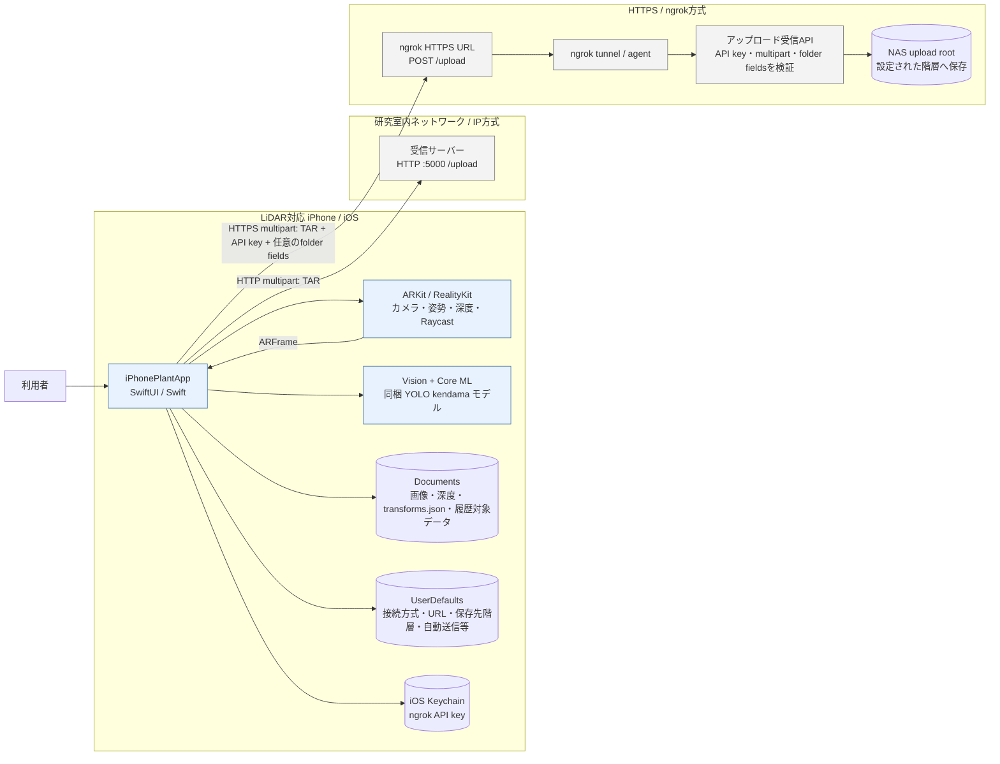
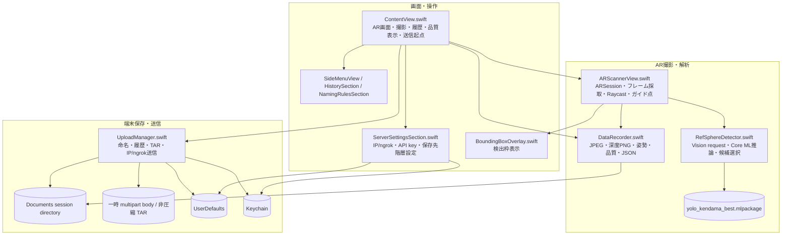
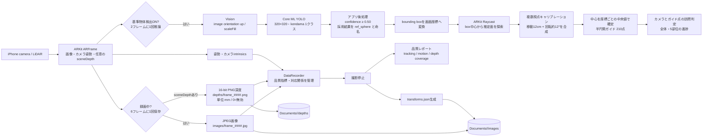
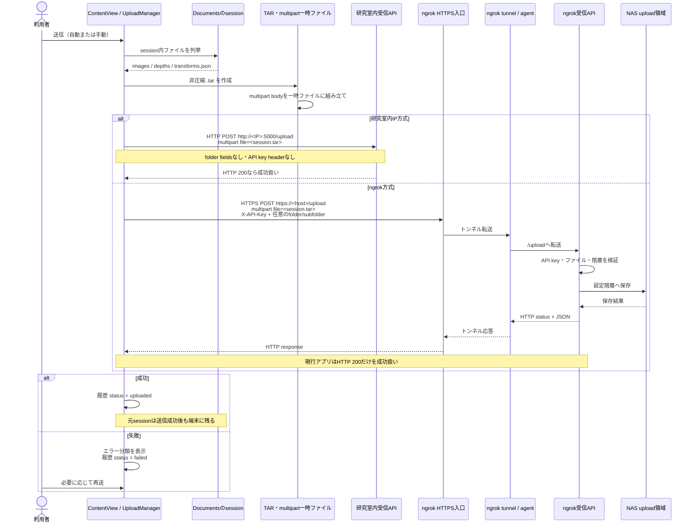
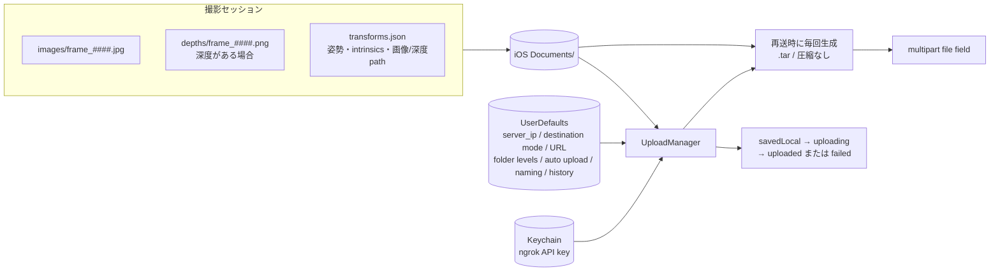
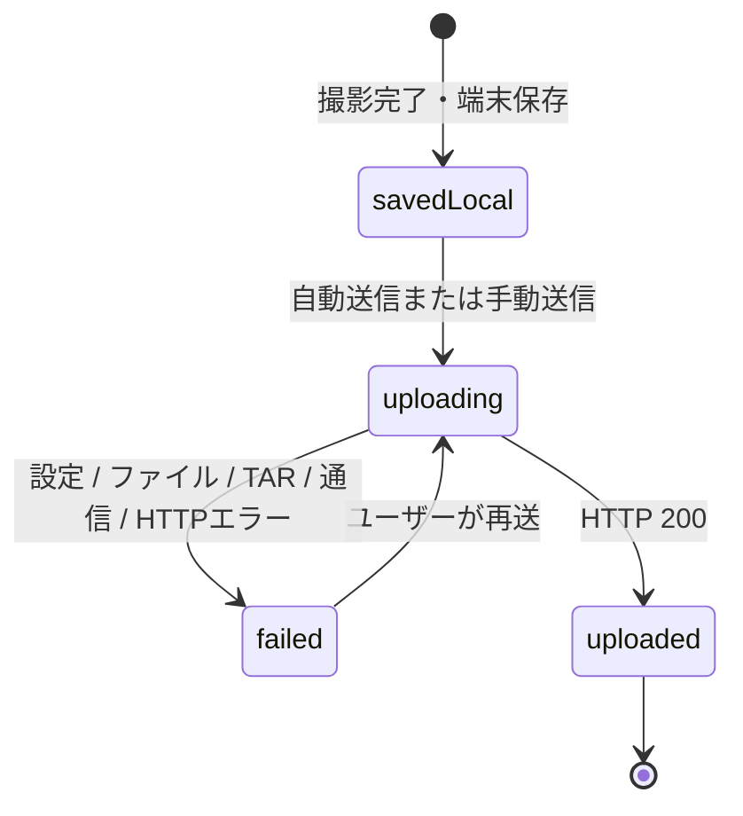

# iPhonePlantApp システム構成図

最終確認日: 2026-09-27  
対象: 現行の iOS アプリ、端末内処理、アップロード経路と保存先

この資料は、ひとつの巨大な図にすべてを詰め込まず、目的別の図を組み合わせてシステム全体を説明します。図の内容はリポジトリ内の現行コードと `APP_REPRODUCTION_SPEC.md` に基づきます。iOSアプリ外の受信サーバーやNASは、アプリから確認できる通信契約と運用情報の範囲で描いています。

## 1. この種のシステム構成図には何があるか

| 図の種類 | 何を示すか | このアプリでの用途 |
|---|---|---|
| システムコンテキスト図 | 利用者、アプリ、外部サービス、保存先の関係 | アプリの境界と、何がアプリの外にあるかを示す |
| ソフトウェア／コンポーネント図 | アプリ内モジュールと責務・依存関係 | Swiftファイル、Apple Framework、データの受け渡しを示す |
| データフロー／処理パイプライン図 | 入力データがどの処理を経て何になるか | AR撮影、AI検出、品質計算、ファイル生成を示す |
| シーケンス図 | 時間順の呼び出し、リクエスト、応答 | IP方式とngrok方式の送信手順・失敗点を比べる |
| 配置／ネットワーク図 | 実行環境、ネットワーク境界、通信経路 | iPhone、HTTP/HTTPS、ngrok、受信API、NASの接続を示す |
| データ／保存図 | ファイル形式、保存場所、設定・状態の永続化 | Documents、UserDefaults、Keychain、TARの関係を示す |
| 状態／エラー遷移図 | 状態変化とエラー分類 | 未送信、送信中、成功、失敗、再送の挙動を示す |

このアプリを「再実装できる粒度」で説明するには、**全体・コンポーネント・撮影データフロー・送信シーケンス／ネットワーク**を中心にし、AIの内部処理とデータ契約を別図にするのが読みやすい構成です。

## 2. 全体構成図（システムコンテキスト＋配置）

ngrok側の保存先階層は設定可能です。現在の既定値は `nakamura` → `トマト動画` で、受信APIがNASの `upload` をルートとしてこの階層を使う場合の保存先は `upload/nakamura/トマト動画` です。**アプリはNASへ直接接続しません**。受信APIが階層をどう解釈し、TARを展開するかはサーバー側の実装に依存します。

## 3. アプリ内部コンポーネント図

### コンポーネント図の読み方

- ARKitのカメラフレームとカメラ姿勢を `ARScannerView` が受け、必要な深度情報とともに撮影側へ渡します。
- `RefSphereDetector` が同梱モデルをVision経由で実行します。現行モデルのクラスは `kendama` で、アプリでは基準球 `ref_sphere` として扱います。トマト部位を認識するモデルではありません。
- `DataRecorder` はセッション一式を端末内に生成し、`UploadManager` はそのディレクトリから送信データを組み立てます。
- `ObjectDetector.swift`、`CoordinateTransform.swift`、`PointCloudVisualizer.swift` は現行経路から未接続です。名前だけで実行中コンポーネントとみなさないでください。

## 4. 撮影・AI・ファイル生成のデータフロー

注意: 検出は撮影保存とは別のフレーム周期で非同期実行されます。深度サンプルから基準物体の3D位置を直接算出する実装ではなく、検出box中心からARKit Raycastした位置を使います。

## 5. アップロード・シーケンス図

送信前の `.tar` は**圧縮ファイルではありません**。TARは複数ファイルを一つのアーカイブにまとめる形式です。ngrok経路でも、アプリが送るのはTARを含むmultipart HTTPリクエストであり、ngrokがファイル形式を変換するわけではありません。

## 6. セッションデータと永続化

## 7. 送信状態と失敗点

送信失敗の画面表示は、設定、端末内データ、TAR/multipart生成、DNS、接続、TLS、認証、サイズ上限、リクエスト形式、URL、レート制限、サーバー応答、タイムアウト／キャンセルなどを区別します。ネットワーク失敗を自動で指数バックオフ再試行する仕組みはなく、「再送」は利用者操作です。

## 8. 境界・未確定事項

- この図で確認しているAIは、同梱の単一クラス `kendama` 検出器です。トマトの葉・実・茎を分類するAIは現行コードにありません。
- アプリは撮影データを生成し送信するクライアントです。ngrok agent、受信API、API key本体、NAS mount、外部サーバーのコードはiOSアプリのリポジトリに含まれません。
- ngrok方式の保存先階層はアプリ設定からmultipart fieldとして渡します。受信APIがNAS上でどのディレクトリに展開／保存するかは、受信側の実装と設定を確認してください。
- IP方式とngrok方式は別々のAPI契約です。IP方式は `http://<IP>:5000/upload`、ngrok方式は設定URLの `/upload` にHTTPSで送ります。
- Xcodeビルドに必要なSwiftソース、Assets、Core MLモデル、プロジェクト設定などの配置図は、リポジトリの現状に基づきます。署名設定や実機のLiDAR動作はビルド／実機環境に依存します。

## 関連資料

- [APP_REPRODUCTION_SPEC.md](APP_REPRODUCTION_SPEC.md): AI、計算式、ファイル形式、HTTP契約、制約を含む再実装仕様
- [README.md](README.md): リポジトリの概要
